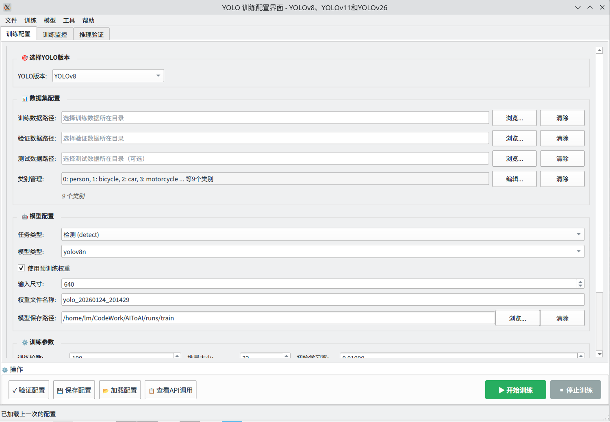
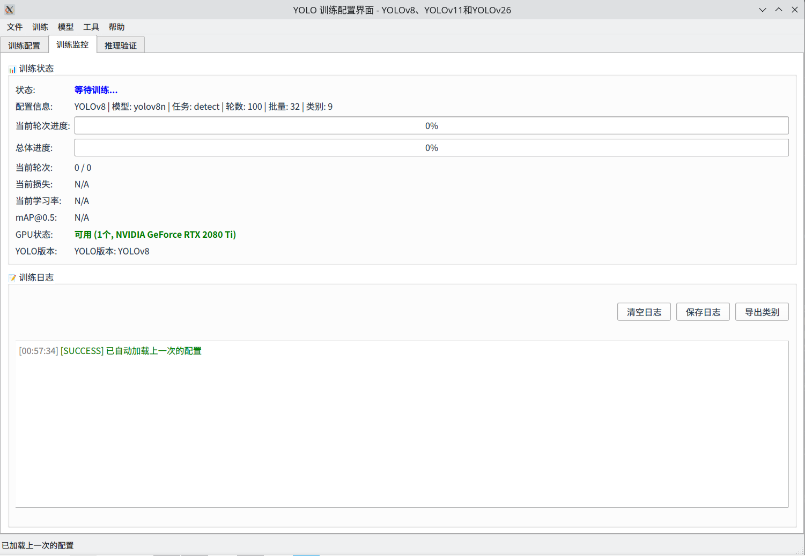
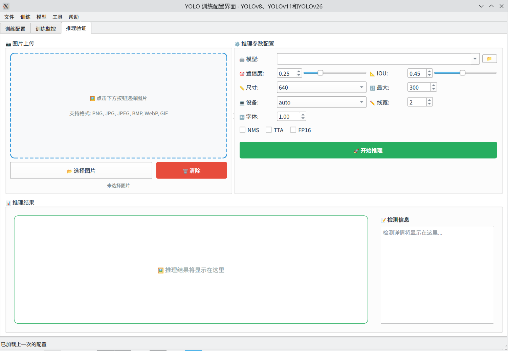

# AIToYolo GUI

2025年底大模型最佳实践竟然是代码生成，于是就通过烧token的模式构建了自己的第一个应用程序。该程序基于 PySide6图形界面，搭建了一个可视化的yolo训练、训练监控、推理的一个简易应用，对于不喜欢命令行的朋友来说是个不错的选择，该程序主要支持（YOLOv8、YOLOv11、YOLOv26）这三个版本。





- 主要文件
  - `yoloGui.py` — 主 GUI 实现，包含训练线程 `YOLOTrainingThread` 与界面控件。

- 特性
  - 支持选择 YOLO 版本（`YOLOv8` / `YOLOv11` / `YOLOv26`）。
  - 支持任务类型：检测（detect）、分割（segment）、分类（classify）。
  - 根据版本与任务动态更新模型类型下拉列表（如 `yolov8n`、`yolov11m-seg` 等）。
  - 支持使用预训练权重或基于 YAML 配置生成新模型。
  - 包含训练线程（`YOLOTrainingThread`），会与 ultralytics YOLO API 对接执行训练并通过信号回传日志与进度。

- 依赖
  - Python 3.8+
  - `PySide6`
  - `ultralytics`
  - 其他常用库：`pyyaml`、`json`（标准库）

- 快速运行
  1. 激活或创建合适的 Python 环境，并安装依赖，例如：

```bash
conda activate yolo
pip install -r requirements.txt  # 若有 requirements，可替换为手动安装
pip install PySide6 ultralytics pyyaml
```

2. 在 `AIToYolo` 目录下运行 GUI：

```bash
python yoloGui.py
```

- 注意
  - 请确保 `ultralytics` 与 `PySide6` 可用于当前环境。
  - `yoloGui.py` 中使用的模型名称与版本（例如 `yolov11`）应与 ultralytics/本地权重命名一致。

如需更详细的使用说明，请参阅 `USAGE.md` 和 `CONFIG.md`。