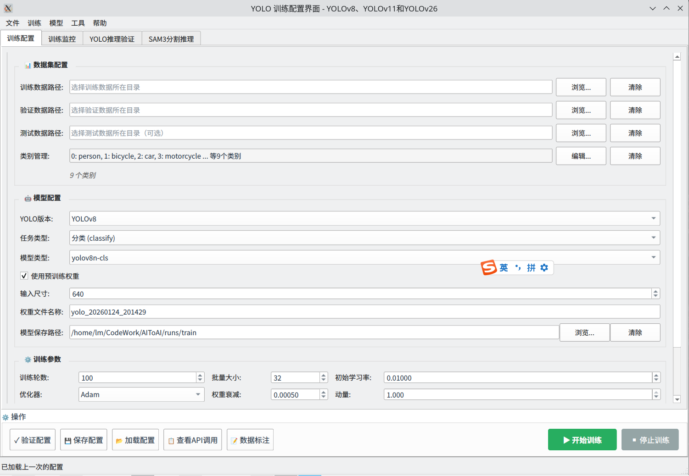
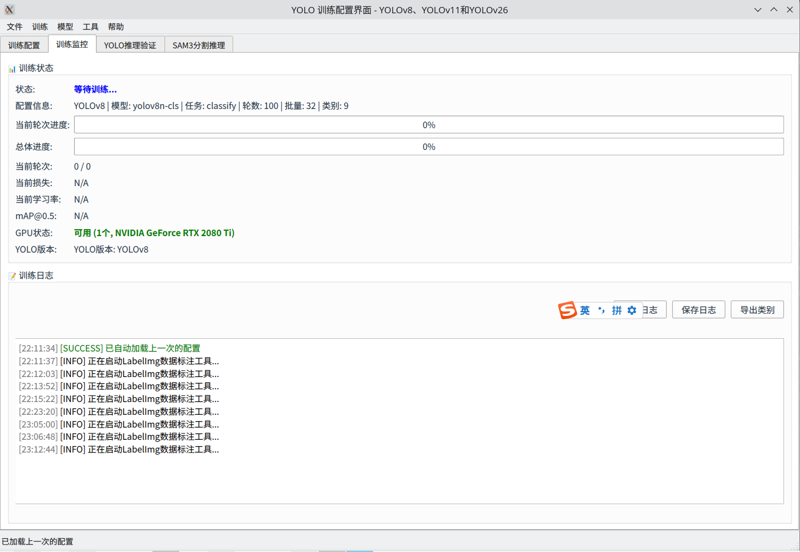
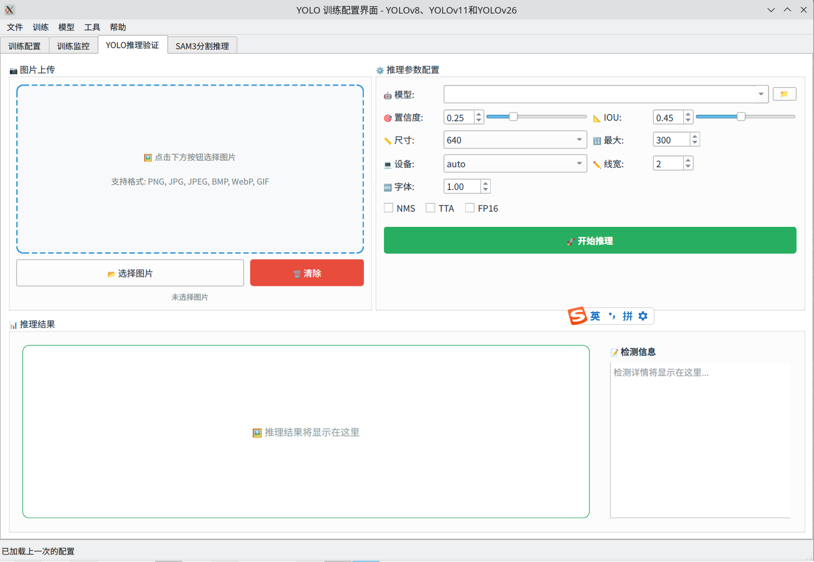
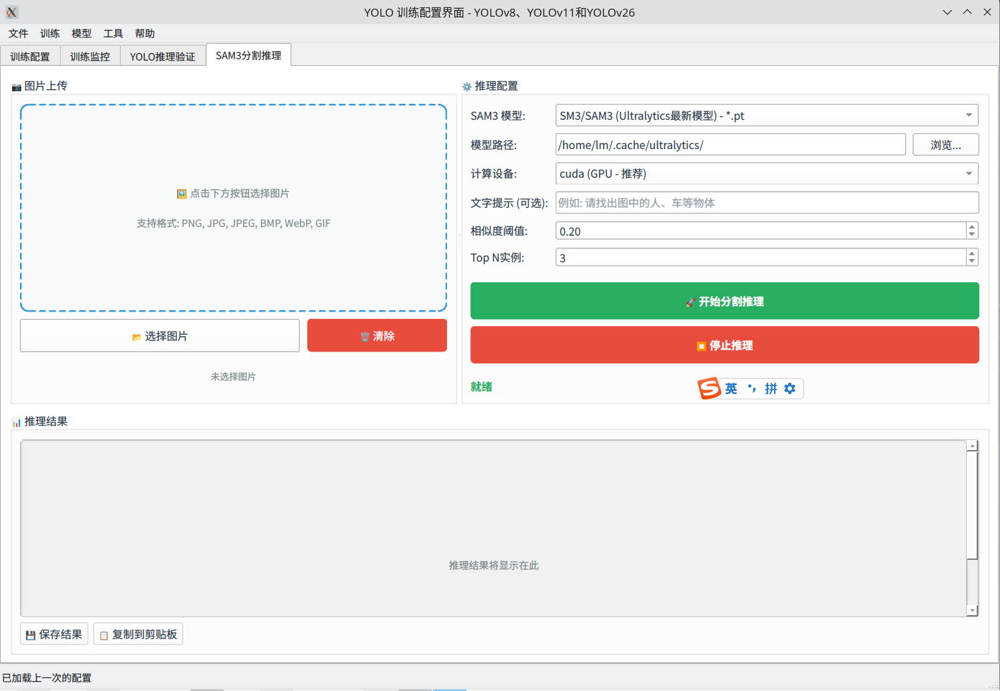
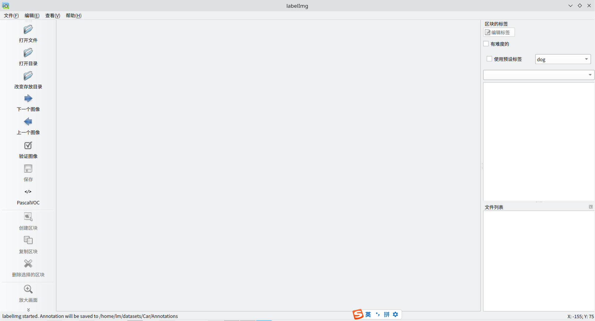

# AIToYolo GUI

  本项目通过本地客户端界面的方式将ultralytics工程主流的模型应用做了可视化应用配置，希望能给喜欢YOLO的同学提供多一种选择。该程序几项特点：

- 1）基于最新的PySide6图形界面进行了搭建；
- 2）主要支持（YOLOv8、YOLOv11、YOLOv26）这三个版本训练和推理；
- 3）支持对最新版本SAM3的推理；
- 4）集成了labelImg标注工具，升级到PySide6界面，并修复了本地化、删除图片跳转索引等问题。







- 主要文件
  - `yoloGui.py` — 兼容入口（保留 `python yoloGui.py` 启动方式）。
  - `gui/windows/trainer_main_window.py` — 主窗口与应用主流程（`YOLOTrainerGUI`、`main`）。
  - `gui/threads/yolo_training_thread.py` — 训练线程实现（`YOLOTrainingThread`）。
  - `gui/threads/yolo_inference_threads.py` — 推理线程实现（`YOLOInferenceThread`、`SAM3InferenceThread`）。
  - `gui/widgets/class_editor_dialog.py` — 类别编辑对话框（`ClassEditorDialog`）。
  - `labelImg.py` — 原生图像标注界面。
  - `requirements-full.txt` — 完整依赖包列表（推荐安装）。

- 特性
  - 支持选择 YOLO 版本（`YOLOv8` / `YOLOv11` / `YOLOv26`）。
  - 支持任务类型：检测（detect）、分割（segment）、分类（classify）。
  - 根据版本与任务动态更新模型类型下拉列表（如 `yolov8n`、`yolov11m-seg` 等）。
  - 支持使用预训练权重或基于 YAML 配置生成新模型。
  - 包含训练线程（`YOLOTrainingThread`），会与 ultralytics YOLO API 对接执行训练并通过信号回传日志与进度。

- 依赖
  - Python 3.8+
  - `PySide6` - GUI框架
  - `ultralytics>=8.2.0` - YOLO模型库（支持YOLOv8/v11/v26）
  - `torch>=2.1.0` & `torchvision>=0.16.0` - PyTorch深度学习框架
  - `opencv-python` - 图像处理
  - `pyyaml` - 配置文件处理
  - 可选依赖：
    - `segment-anything` - Meta原始SAM模型支持
    - `open_clip_torch` - CLIP文字提示支持
    - `transformers` - HuggingFace模型支持

- 快速运行
  1. 激活或创建合适的 Python 环境，并安装依赖：

```bash
# 创建新的conda环境（推荐）
conda create -n yolo-gui python=3.10 -y
conda activate yolo-gui

# 安装核心依赖
pip install PySide6 ultralytics>=8.2.0 torch>=2.1.0 torchvision>=0.16.0 opencv-python pyyaml

# 安装可选依赖（用于SAM3文字提示功能）
pip install segment-anything open_clip_torch transformers
```

  或使用一键安装脚本：

```bash
# 克隆项目后运行
git clone <repository-url>
cd yoloGuiTool

# 自动安装所有依赖
pip install -r requirements-full.txt  # 推荐：一键安装所有依赖
```

1. 在项目目录下运行 GUI：

```bash
python yoloGui.py
```

## 注意

- 请确保 `ultralytics` 与 `PySide6` 可用于当前环境。
- `yoloGui.py` 中使用的模型名称与版本（例如 `yolov11`）应与 ultralytics/本地权重命名一致。
- SAM3功能需要PyTorch 2.1.0+和Ultralytics 8.2.0+支持。
- 文字提示功能需要安装可选依赖：`open_clip_torch` 或 `transformers`。

## 架构演进

- 若你准备拆分 `yoloGui.py`，可参考 `docs/yolo_gui_refactor_plan.md`。
